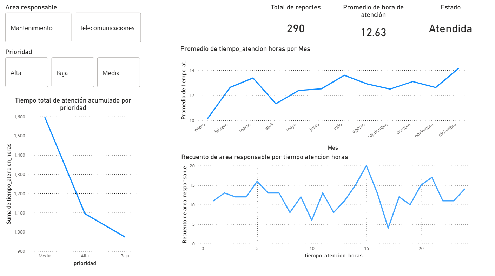

# 📊 Análisis de Incidencias Operativas

Proyecto de análisis de datos enfocado en el tiempo de atención de incidencias operativas,
utilizando **SQL, Python (pandas) y Power BI**.

## 🧠 Objetivo
Analizar el comportamiento del tiempo de atención de incidencias atendidas,
identificando tendencias mensuales, diferencias por prioridad y área responsable.

## 🛠️ Tecnologías utilizadas
- MySQL
- SQL
- Python (pandas, matplotlib)
- Power BI

## 🔄 Flujo del proyecto
1. Extracción de datos desde MySQL
2. Limpieza y filtrado en Python (solo incidencias atendidas)
3. Exportación a CSV optimizado
4. Visualización y análisis en Power BI

## 📊 Visualizaciones (Power BI)

El dashboard incluye:
- Tiempo promedio de atención por prioridad
- Comparación por área responsable
- Tendencia mensual de incidencias atendidas

📸 Ejemplo del dashboard:

## 📂 Estructura del repositorio
- `data/raw`: dataset original
- `data/processed`: datos limpios para Power BI
- `sql`: consultas SQL utilizadas
- `python`: análisis en Jupyter Notebook
- `powerbi`: dashboard final

## 📈 Principales insights
- El tiempo promedio de atención de incidencias atendidas es de ~12.6 horas
- Las incidencias de prioridad media concentran mayor tiempo acumulado
- Se observa una tendencia al alza en ciertos meses del año

## 📌 Autor

**Aldhair Deyner Gonzales Vicente**  
Analista de Datos Junior | SQL · Python · Power BI  

Proyecto desarrollado como parte de mi formación práctica en análisis de datos,
aplicando un flujo completo desde base de datos relacional hasta visualización
para toma de decisiones.

